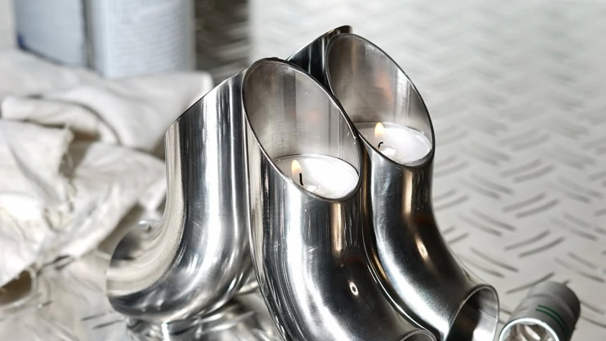
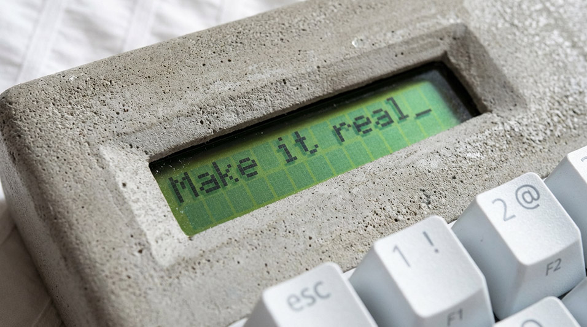
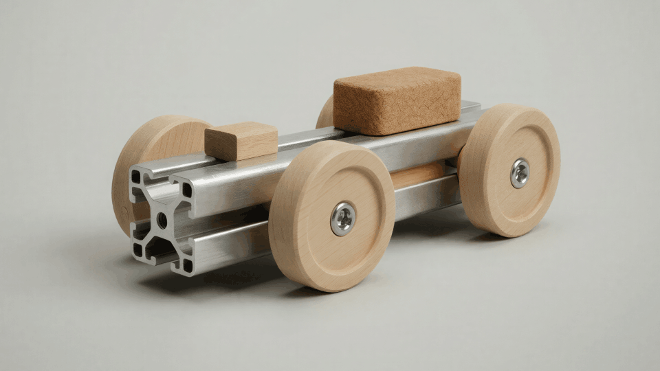

# Hold Your Ideas: The Saman

*How Andrew Moya and Juan Rujana designed a mule rooted in Pre-Columbian artifacts — and used Vizcom to bring it from sketch to production with Zellerfeld.*

## The Spark

Most shoe designs begin with a silhouette and work outward. Andrew Moya and Juan Rujana started somewhere else — with the objects in the museums of Bogotá and Mexico City. The gold figures behind the glass. The ceremonial pieces nobody in the family had ever been allowed to wear. They wanted a mule, but they wanted it to remember something.

The Saman is what came back.

## Material Honesty

The brief was specific. A mule rooted in Latino culture and Pre-Columbian artifacts, drawn from indigenous art of Central and South America. The reference material was concrete: gold figures, ceremonial objects, primordial forms. Not as a mood-board mood — as direct material cues.

The amber color echoes ancestral gold. The seashell shapes the shoe itself — its body curves the way a chambered nautilus curves, only worn. Veins run through the surface like tree roots, carrying through to the sole. The shoe doesn't sit on top of its references. It is made of them.

## Andrew and Juan's Vizcom Workflow

### Translating reference into form

The hard part of working from cultural artifacts is keeping the reference legible without flattening it into kitsch. Andrew and Juan used Vizcom to iterate on the surface treatment — testing how heavily the veins should read, how deep the seashell curve should go, where the amber should pool and where it should fade.

They started with sketches that pulled directly from museum photography. Each reference became a Vizcom layer, sometimes a Modify pass, sometimes an Instant Render with a tight prompt. The point wasn't to copy any one artifact. It was to find a body of work that recognized the same source.

### Refining the amber and the veins

Two details took the longest. The amber, which had to read as ancestral gold without becoming "shoe in the color gold." And the veins, which needed to feel like roots without becoming pattern.

For the color, they worked in Extract — isolating the amber and adjusting saturation and undertone in dozens of micro-passes. The shoe needed to look like the metal had been part of the earth before it became ornament. For the veins, Modify let them control density and direction — denser at the heel, looser at the toe, with the surface pattern carrying through the sole so the visual language between upper and lower never broke.

### From digital to physical with Zellerfeld

Once the form resolved, the handoff to fabrication was a question of materials and 3D-printability. Zellerfeld, which 3D-prints footwear in single-material elastomers, picked it up. The renders Andrew and Juan made in Vizcom became the spec. The handoff document was thin because the renders did the work.

## From Pixels to Production

The version that ships looks like the renders. The amber holds. The veins are visible without being loud. The seashell body fits the foot the way it fit the screen. Andrew and Juan spent the iteration time on the screen so the print would not require it.

The first physical pull surprised them in only one way: how much the amber color shifted under natural light versus how it looked on a calibrated monitor. That's the kind of thing renders cannot fully predict. But the form, the proportions, the surface treatment — all of those held.

## What's next

The Saman is the first in what Andrew and Juan describe as a longer line of work — a small body of shoes that take the same posture toward inheritance. Not every reference will be Pre-Columbian, and not every form will be a mule. But the practice — start in a museum, refine in Vizcom, finish at Zellerfeld — looks like one they'll keep.

The renders for the next one are already in Workbench.

## A Note to Fellow Designers

Andrew and Juan's advice, when asked, was modest: start with what you actually carry with you, not with what you think a shoe should be. Cultural memory is a strong design brief. The Saman did not begin as a market opportunity. It began as a question about objects in glass cases.

It just takes a tool that can hold the reference at high fidelity while you iterate, and a production partner willing to print what the renders ask for.

---

**Design:** Andrew Moya and Juan Rujana
**Location:** [NEEDS CONFIRMATION — designer location/handles not in signal]
**Specialization:** Footwear Design
**Visualization:** Vizcom
**Materials:** Amber color treatment, seashell-form body, veined surface, 3D-printed single-material elastomer with Zellerfeld

---

Want to bring your own ideas to life at the speed of thought? [Try Vizcom for Yourself →](https://app.vizcom.com)

Follow us on [Instagram](https://instagram.com/vizcom_), [X](https://x.com/Vizcom_), and [LinkedIn](https://www.linkedin.com/company/vizcomhq/).

Have feedback? DM us or drop a note in our [Discord](https://discord.com/invite/5qqzBcVv58) — we're listening.
