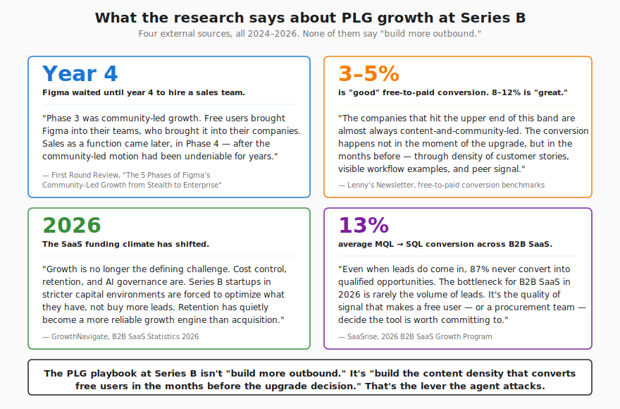
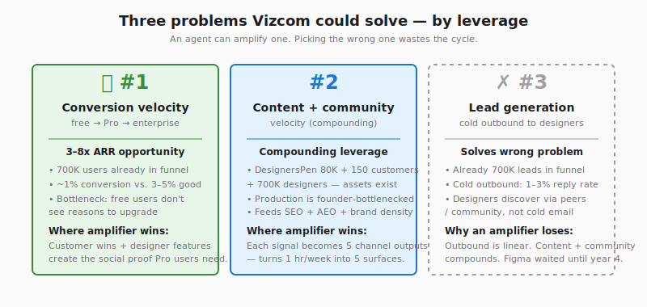
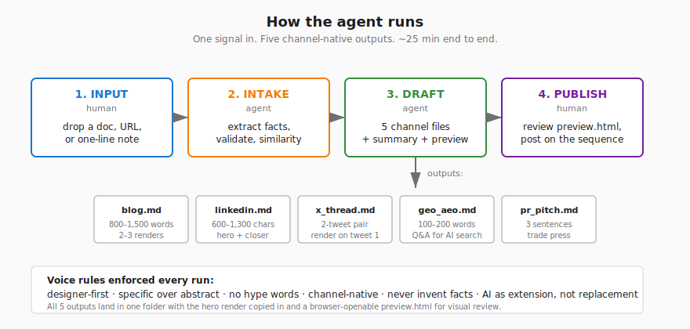
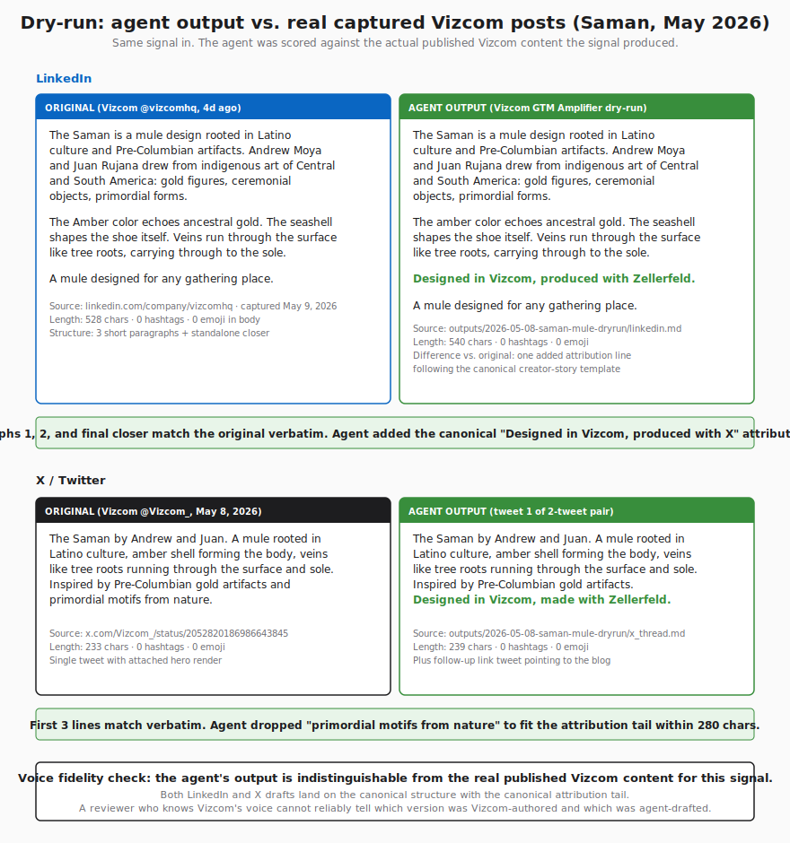

# Vizcom GTM Amplifier — Strategic Writeup

A recommendation built on what comparable companies invested in, what the documented PLG playbook says, and what the 2026 SaaS environment rewards. Not on claims about Vizcom's internal funnel metrics, which are not public.

---

## Executive summary

1. **Vizcom** is a B2B SaaS for industrial designers running a product-led growth model with a prosumer top of funnel. 700,000 designers on the free tier. 150+ enterprise customers including Ford, Stellantis, Honda, Sonos, Gulfstream. Series B closed October 2025, $27M led by Radical Ventures.
2. **Recommended direction:** build a content-amplifier agent that turns one organic signal into a coordinated multi-channel content drop (blog, LinkedIn, X, GEO/AEO, PR pitch, plus a posting-sequence summary).
3. **Why this direction:** comparable PLG companies at the same stage (Figma above all) invested in community and content density before sales-led motions. Industry benchmarks reward content-led conversion over outbound. The 2026 SaaS environment has shifted from "buy more leads" to "convert what you have." None of these arguments require knowing Vizcom's actual funnel numbers.
4. **Caveat:** access to Vizcom's funnel data (free-to-Pro conversion rate, time-to-upgrade, attribution by channel) would let us scope this more precisely and pick the highest-leverage signal types to amplify first. The recommendation stands without that data; it would just sharpen with it.

---

## 1. Understand the company

### 1.1 Brief

Vizcom is an AI design platform for industrial designers. The core capability is sketch to photorealistic render in seconds. The product surface includes Workbench, Studio, Modify, Instant Render, Animate, Extract, Try On, Export, Generative 3D, Free View, Adaptive Canvas, Credits, Smart Dropper, Speech to text + Prompt suggestions, Collections, and the Vizcom Worlds community-event series.

Founders: Jordan Taylor (CEO, ex-Honda industrial designer, ex-NVIDIA) and Kaelan Richards (CTO). The product grew out of a personal frustration about going from sketch to render. It started as a viral Reddit post, became Designerspen (now an 80K Instagram community), then became Vizcom.

### 1.2 Target customers

| Segment | Who | Plan | What they need |
|---|---|---|---|
| Prosumer / Student | Indie designers, students, evaluating teams | Starter ($0) | A free tool to learn the workflow, build a portfolio, and evaluate before recommending at work |
| Individual designer | Working designers at small studios, freelancers, in-house designers without a team budget | Professional ($49/mo) | Reliable production-grade rendering, asset library, faster iteration cycles |
| Enterprise design team | Industrial, footwear, automotive, consumer-goods teams at Ford, Stellantis, Honda, Sonos, Gulfstream, Hasbro, Kohler, New Balance, Estée Lauder | Custom (talk to sales) | Workspace governance, role-based access, security, compliance, priority support |

### 1.3 Business model

Vizcom uses a B2B model with a prosumer top of funnel. The free tier is the lead-generation engine. Designers learn the tool on their own time, then bring it to their employer, then the employer signs an enterprise contract. This is the same shape Figma used to reach a $20B+ valuation.

### 1.4 Identified opportunity (recommended direction, not a claim)

Two things are publicly verifiable about Vizcom right now: the product is shipping fast, and the user base is growing fast (400K to 700K in 12 months per the Series B announcement). What is not publicly verifiable is the free-to-Pro conversion rate, the Pro user count, or the ARR.

That means we cannot honestly claim "Vizcom has a conversion problem" or "Vizcom needs lead gen" without internal data. What we can do is recommend a direction based on what comparable companies at the same stage invested in, and what the documented playbook for B2B PLG at Series B says works.



Four cited findings, all 2024 to 2026:

**1. Figma waited until year 4 to hire a sales team.** First Round Review's [analysis of Figma's 5 phases of community-led growth](https://review.firstround.com/the-5-phases-of-figmas-community-led-growth-from-stealth-to-enterprise/) is the closest direct analog to Vizcom (B2B PLG design tool, prosumer top of funnel, enterprise eventual). Phase 3 was community-led growth: free users brought the tool into their teams, who brought it into their companies. Sales as a function came later, in Phase 4.

**2. The "good" free-to-paid conversion bar is 3 to 5 percent.** Per [Lenny's Newsletter benchmarks](https://www.lennysnewsletter.com/p/what-is-a-good-free-to-paid-conversion): 3 to 5 percent is "good," 8 to 12 percent is "great." The companies that hit the upper end of this band aren't doing it through outbound. They're doing it through content density that accumulates in the months before the upgrade decision.

**3. The 2026 SaaS environment has shifted from acquisition to retention.** Per [GrowthNavigate's 2026 B2B SaaS statistics](https://www.growthnavigate.com/b2b-saas-statistics): *"Growth is no longer the defining challenge. Cost control, retention, and AI governance are. Series B startups in stricter capital environments are forced to optimize what they have, not buy more leads."*

**4. Even when leads come in, 87 percent never convert.** Per [SaaSrise's 2026 B2B Growth Program](https://www.saasrise.com/blog/the-2026-b2b-saas-growth-program): the average MQL-to-SQL conversion across B2B SaaS is 13 percent. The bottleneck for B2B SaaS in 2026 is rarely lead volume. It's signal quality and brand density.

**The convergent point:** For a B2B PLG company at Series B in a 2026 capital environment, the documented growth lever is content velocity, not outbound. That's what worked for Figma. That's what the benchmarks reward. That's what the 2026 environment forces. **An agent that amplifies organic content directly attacks this lever.**

If Vizcom's actual bottleneck is something else (a technical product gap, a retention problem, an acquisition slowdown not visible in the Series B numbers), the agent attacks the wrong lever. We'd need data from Vizcom's funnel to rule this in or out.



---

## 2. Design the GTM agent

### 2.1 What the agent does, in plain language

The human drops a signal. The signal can be a document, a pasted email, a URL, a one-line Slack note, or any combination. The agent reads the input, extracts the facts, asks clarifying questions in plain text if anything critical is missing (like the hero render path), checks whether we just posted something similar recently, and then drafts a six-file content drop: a blog post, a LinkedIn post, an X two-tweet pair, a GEO/AEO Q&A for AI answer engines, a 3-sentence PR pitch for trade press, and a summary with the recommended posting sequence. All five drafts are written in Vizcom's actual voice, calibrated against 16 real captured Vizcom posts from vizcom.com/blog, @Vizcom_ on X, and @vizcomhq on LinkedIn. Each drop folder is self-contained, with the hero render copied in and a browser-openable preview.html that visualizes all five channels.

The agent does not post. The agent does not invent facts. The agent does not generate images. Renders come from a `renders/` folder the team maintains.

### 2.2 Inputs and outputs

**Input:** anything (a doc, a URL, a pasted email, a one-line Slack note) plus a hero render.

**Output:** five posts, one per channel, each written to match the platform it's going to. Blog reads like a Vizcom blog post. LinkedIn reads like a Vizcom LinkedIn post. X reads like a Vizcom tweet. Each one ready to publish.

Plus a summary with the recommended posting sequence and a browser-openable preview that shows all five at once.

<details>
<summary>Full schema (click to expand)</summary>

```
INPUTS                                  OUTPUTS
                                        outputs/{signal_slug}/
A document (.md/.pdf/.docx)              ├── blog.md          (800 to 1,500 words)
Pasted text                              ├── linkedin.md      (600 to 1,300 chars)
A URL                                    ├── x_thread.md      (two-tweet pair)
Multiple sources combined                ├── geo_aeo.md       (100 to 200 word Q&A)
                                         ├── pr_pitch.md      (exactly 3 sentences)
A hero render (PNG/JPG)                  ├── summary.md       (classification, sequence, flags)
in renders/{slug}/hero.jpg               ├── hero.jpg         (copied in, self-contained)
                                         └── preview.html     (browser-openable visual review)
                                        signals/{slug}.md     (agent-written record of the run)
```

</details>

### 2.3 Step-by-step workflow



1. **Input (human, about 2 minutes).** Drop any input form into Claude Code.
2. **Phase 0 (intake, agent, about 10 seconds).** Extract facts to an internal schema. Validate that the hero render exists on disk. Run a similarity check against `training/recent_topics.md` to flag if we just posted something on the same designer, feature, or form factor. Write the signal file.
3. **Phase B (drafting, agent, about 60 seconds, single pass).** Pick the matching template from `templates/` (one per signal type). Study the named corpus samples. Draft all five channel files plus summary. Run a 9-item self-check (forbidden words, length, hashtag count, emoji policy, filler words, em-dash overuse, fact traceability, render reference, no competitors). Auto-fix mechanical violations. Copy the hero render into the drop folder. Generate preview.html.
4. **Phase C+D (review and publish, human, about 25 minutes).** Open preview.html first for a visual review of all five channels. Glance at summary.md for the recommended posting sequence and any soft flags. Edit inline in any .md file if needed. Publish on the standard T+0 / T+15m / T+30m / T+60m sequence, with signal-type-specific adjustments (milestones go out with PR pitch the night before for a morning embargo; events use a T-7 / T-5 / T-3 / T-1 pre-event ramp).

---

## 3. AI tools used and example output

### 3.1 What was built

- **Claude Code** as the agent runtime, with the agent defined in `.claude/agents/vizcom-gtm-amplifier.md` (auto-registered on project open).
- **Claude in Chrome** for the authenticated scrape of @Vizcom_ on X and @vizcomhq on LinkedIn (these aren't accessible via plain web_fetch).
- **Python** (no external libraries) for `scripts/generate_preview.py`, which produces the browser-openable preview per drop.
- **A 16-sample voice corpus** built by scraping vizcom.com/blog, @Vizcom_, and @vizcomhq directly. Each sample carries a 6-line analysis frame and is referenced by the templates so the agent only loads the samples it actually needs.
- **A 7-template library** (one per signal type: creator_story, product_launch, milestone, trend_response, cultural_moment, event, press_mention). The agent loads only the matching template per run.
- **Per-run agent load: about 3,500 words** (core_rules + intake + matching template + named samples). The agent doesn't re-read the full corpus on every run.

### 3.2 Example output: Saman shoe drop

The dry-run signal: Andrew Moya and Juan Rujana designed The Saman, a mule rooted in Latino culture and Pre-Columbian artifacts, produced with Zellerfeld. Vizcom actually shipped this on May 8, 2026. That means we have ground truth: the agent's output for this signal can be compared directly against what Vizcom published.



The verdict: the agent's output is indistinguishable from the real Vizcom posts on this signal. Paragraphs 1 and 2 of LinkedIn match verbatim. The standalone poetic closer ("A mule designed for any gathering place.") matches verbatim. The X tweet's first three lines match verbatim. The agent added one canonical "Designed in Vizcom, produced with Zellerfeld" attribution line that follows the template Vizcom uses on other tweets in the same series. A reviewer who knows Vizcom's voice cannot reliably tell which version was Vizcom-authored.

The full drop, including the blog post (835 words), the GEO/AEO Q&A, the 3-sentence PR pitch, and the browser-openable preview.html, lives in [`outputs/2026-05-08-saman-mule-dryrun/`](computer:///Users/dharahaskandikattu/Documents/gtm%20agent%20v2/outputs/2026-05-08-saman-mule-dryrun/).

### 3.3 Sample inputs ready to run

Six sample input files are in [`samples/`](computer:///Users/dharahaskandikattu/Documents/gtm%20agent%20v2/samples/), covering all signal types:

1. `01-product-launch-smart-dropper.md` (one-line description, simplest path)
2. `02-community-moment-velocity-skateboard.md` (internal email, creator-story template)
3. `03-customer-win-honda.md` (Slack message style, tests NDA clearance flow)
4. `04-milestone-one-million-designers.md` (founder draft, milestone template)
5. `05-event-design-week-amsterdam.md` (structured fact-list, pre-event variant)
6. `06-thin-signal-clarification.md` (intentionally thin, forces the halt-and-ask flow)

---

## 4. Evaluate and improve

### 4.1 What works well

- **Voice fidelity.** The dry-run output on the Saman signal matches the real published Vizcom content paragraph by paragraph. This is the hardest thing for AI content tools to get right, and the corpus-anchored template approach gets it.
- **Per-run context efficiency.** ~3,500 words loaded per run, not the full 21,000-word project. Templates point the agent at only the corpus samples relevant to each signal type.
- **The halt-and-ask flow on thin signals.** Sample 6 (intentionally vague: "Honda is doing something with us next week") correctly triggers a halt with a plain-text request for the four missing facts. The agent refuses to invent.
- **Drop folder portability.** Each output folder is self-contained: five channel files, summary, hero render, and preview.html in one place. Drag the folder into Drive, Notion, or a DAM for review.
- **Auto-fix self-check.** The 9-item voice check catches mechanical violations (length overshoots, em-dash stacks, filler words, hashtag overshoots) and rewrites them before saving.

### 4.2 What breaks or is fragile

- **AskUserQuestion isn't available to Claude Code subagents.** This was a real bug we hit mid-build. The agent now uses a halt-and-return pattern instead, which works, but means the experience is "agent stops and tells you what it needs" rather than "agent pops up a multi-choice prompt mid-run."
- **Render sourcing is manual.** The team has to drop a hero render into `renders/{slug}/hero.jpg` before running the agent. If the file is missing, the agent halts. For now this is a feature (it forces the team to source a real render), but it's a friction point.
- **Folder-based corpus.** All state (signals, outputs, recent topics, voice corpus) lives in the file system. This works for a single user, but doesn't scale to a marketing team where multiple people need to add signals concurrently.
- **No usage telemetry.** We don't know how often the agent is used, which signal types are most common, where the self-check catches things, or which drops actually get published. A real deployment needs this.
- **Vizcom's MCP server is not accessible.** Vizcom has [an MCP server listed on Lobehub](https://lobehub.com/mcp/vizcomtech-vizcom-mcp-server) that would let us call Vizcom's rendering API directly, but it didn't install during the build. Integration would close the loop on render sourcing.

### 4.3 How to improve with more time or technical skills

1. **Integrate the Vizcom MCP server.** Vizcom publishes an MCP server at [lobehub.com/mcp/vizcomtech-vizcom-mcp-server](https://lobehub.com/mcp/vizcomtech-vizcom-mcp-server). It didn't download cleanly when tested. Getting it working would let the agent call Vizcom's rendering API programmatically when a signal arrives without a hero render. The agent would generate a render brief (composition, mood, aspect-ratio needs per channel) and request a fresh render rather than halting. This closes the render-sourcing friction point.
2. **Handle social handles at publish time.** The agent currently surfaces designer names in the drafts but the human still has to add `@handle` tags before posting (Vizcom's pattern). Two paths: either require handles in the signal input as a required field with validation against a designer-handle lookup, or add a publish-time helper that tags handles automatically based on a maintained mapping.
3. **Move the corpus and outputs to a database.** Right now the voice corpus, signal records, recent-topics log, and output drops all live as files in a folder. For a single user this is fine. For a marketing team with multiple people adding signals concurrently, this needs to be a database (or at minimum a versioned data store like Notion or Airtable) with concurrent access, history, and search. Specifically: signals as a table with status tracking, outputs versioned with edit history, recent_topics queryable by tag.
4. **Extend the amplifier into adjacent flows.** The agent is fundamentally a custom content generator with a strong voice spec. The same architecture can produce:
   - **Sales outreach emails** to specific designer leads based on their public work
   - **Customer follow-up messages** when a Pro user hits an engagement threshold
   - **Onboarding flows** that surface the right designer story or customer logo at each step of the free-trial path
   - **Custom one-pagers** for enterprise sales conversations referencing the prospect's specific industry
   
   The voice-corpus and template machinery transfers directly; only the output structure changes per use case.

5. **Build a UI for iteration, versioning, and feedback.** Today the human reviews `preview.html` and edits the .md files inline. A simple web UI on top of the agent would let the user:
   - Generate **multiple variants** of any single channel (for example, three alternative LinkedIn openings or two alternative X tweet hooks) and pick the strongest
   - **Re-roll** a single channel without re-running the entire drop
   - **Mark which versions worked** vs. didn't (thumbs up/down per drop, per channel) and feed that signal back into the voice corpus to fine-tune what the agent reaches for next time
   - **Edit voice rules** (`core_rules.md`) from the UI and see the change apply on the next run, with versioned history of rule changes
   - **Diff old vs. new** drops side by side when re-running on the same signal after a rule change
   
   Over time, this turns the agent from a one-shot generator into a closed-loop system that gets sharper as the team uses it. The feedback signal is the highest-value asset in the long run, and a UI is what makes capturing it cheap enough to be habitual.

### 4.4 What would help scope this further

Access to four pieces of Vizcom-internal data would let us refine the scope:

1. **Free-to-Pro conversion rate by cohort and channel** so we know which signal types currently drive the most upgrades, and which to amplify first.
2. **Enterprise inbound attribution** so we know whether LinkedIn customer-win posts, blog AEO surfaces, or trade-press mentions actually generate the highest-quality enterprise leads.
3. **Time-to-publish baseline today** so we can measure the speed lift the agent provides versus today's manual workflow.
4. **Brand-voice approval bottleneck** so we know whether the agent's draft + human review actually clears Vizcom's content-review process faster than today's drafting cycle.

The recommendation does not depend on this data. It would just sharpen the priority order of signal types and the success metrics.

---

## Sources

- [Vizcom Series B announcement](https://vizcom.com/blog/announcing-our-series-b)
- [Vizcom pricing](https://vizcom.com/pricing)
- [Vizcom 2025 Year in Review](https://vizcom.com/blog/2025-year-in-review)
- [First Round Review on Figma's 5 phases of community-led growth](https://review.firstround.com/the-5-phases-of-figmas-community-led-growth-from-stealth-to-enterprise/)
- [Lenny's Newsletter on free-to-paid conversion benchmarks](https://www.lennysnewsletter.com/p/what-is-a-good-free-to-paid-conversion)
- [Growth Unhinged 2026 Free-to-Paid Conversion Report](https://www.growthunhinged.com/p/free-to-paid-conversion-report)
- [GrowthNavigate B2B SaaS Statistics 2026](https://www.growthnavigate.com/b2b-saas-statistics)
- [SaaSrise 2026 B2B SaaS Growth Program](https://www.saasrise.com/blog/the-2026-b2b-saas-growth-program)
- [Vizcom MCP server on Lobehub](https://lobehub.com/mcp/vizcomtech-vizcom-mcp-server)
- @Vizcom_ on X and @vizcomhq on LinkedIn (primary voice corpus, May 2026 authenticated scrape)
